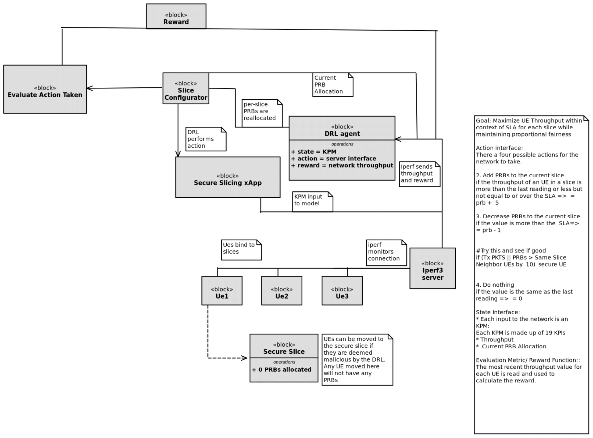
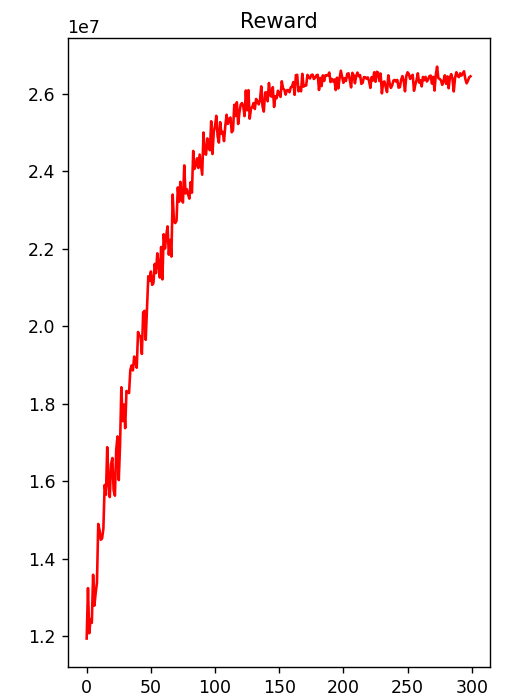
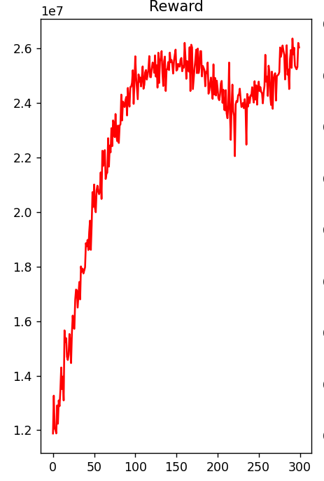
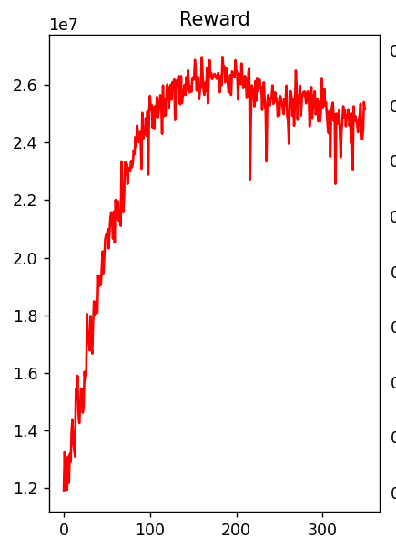

# DRL Secure Slicing agent training and inference

## **Objective**

The objective is to maximize the overall throughput for all slices by mapping resource blocks (RBs) while ensuring minimum QoS agreements are met and maximum thresholds for each slice are upheld via secure slicing:

$ \\max\_{T_1, T_2, T_3} \\sum\_{i=1}^{3} T_i $

where $ T_1 $, $ T_2 $, and $ T_3 $ represent the throughput for URLLC, eMBB,
and Medium slices, respectively.

## **Constraints**

The optimization problem is subject to the following constraints:

1\. **QoS Constraint for URLLC:** The throughput of URLLC must satisfy
theultra-reliable and low-latency requirement while being constrained by the
minimum QoS threshold for the Medium slice. This can be expressed as:

$ \\theta\_{\\text{min}} < \\text{QoS}\_{\\text{URLLC}}(T_1) < \\theta\_{\\text{URLLC}} $

where $ \\theta\_{\\text{URLLC}} $ is the minimum QoS threshold for the
URLLCslice and $ \\theta\_{\\text{min}} $ is the minimum QoS threshold for the
Medium slice.

2\. **QoS Constraint for eMBB:** The throughput of eMBB must meet the enhanced

broadband requirement:

$ \\text{QoS}\_{\\text{eMBB}}(T_2) \\geq \\theta\_{\\text{eMBB}} \\quad \\text{(high data rate requirement)} $

where $ \\theta\_{\\text{eMBB}} $ is the minimum QoS threshold for the eMBB slice.

3\. **QoS Constraint for Medium Slice:** The throughput of the Medium slice must satisfy its QoS requirements, which is between URLLC and eMBB:

$ \\theta\_{\\text{URLLC}} \\leq \\text{QoS}\_{\\text{Medium}}(T_3) \\leq \\theta\_{\\text{eMBB}} $

4\. **Resource Allocation Constraint:** The total allocated resources (Physical Resource Blocks) for all slices cannot exceed the available resources $ R\_{\\text{total}} $:$ \\sum\_{i=1}^{3} R_i \\leq R\_{\\text{total}} $

where $ R_i $ is the resource allocation for slice $ i $.

5\. **Secure Slicing Constraint:** All UEs in the slice must operate below the maximum threshold; otherwise, they are considered malicious and may compromise the resources of legitimate UEs. Let $ \\tau\_{\\text{max}} $ represent the maximum allowable resource usage per UE. The constraint can be expressed as:

$ S\_{u,i} < \\tau\_{\\text{max}}, \\quad \\forall u \\in U_i $

where $ S\_{u,i} $ is the resource usage for UE $ u $ in slice $ i $, and $ U_i $ is the set of UEs in slice $ i $.

## **Approach**

The diagram outlines a framework for allocating physical resource blocks (PRBs) among user equipment (UE) slices using a Deep Reinforcement Learning (DRL) agent in a secure slicing xApp environment.

### Key Components

 **DRL Agent**: Uses Key Performance Metrics (KPM) as input, actions for PRB reallocation, and network throughput as the reward. The agent's operations include:

**State**: Input from KPM.

**Action**: Adjust PRB allocations.

**Reward**: Based on network throughput performance.

**Slice Configurator**: Implements the DRL agent’s actions by reallocating PRBs to slices.

**Secure Slicing xApp**: Executes resource adjustments and handles UE security.

**UE Instances**: Devices bound to slices, with the potential to be moved to a secure slice if detected as malicious.

**iperf3 Server**: Generates traffic in the Downlink for user traffic.

### DRL Agent Actions

1 - 3. **Increase PRBs**: Adds 5 PRBs if a slice's throughput is insufficient but below or equal to the SLA. Removes 5 PRB if throughput exceeds the SLA requirements and gives 0 reward for that episode. 

4. **Secure UE**: Moves UEs to a secure slice if malicious behavior is detected.

### Workflow

1\. The DRL agent receives real-time KPM data and adjusts PRBs through the Slice Configurator.

2\. The iperf3 server provides throughput feedback to guide resource allocation.

3\. A reward function evaluates actions to maximize UE throughput while ensuring fairness and preventing malicious activity.

### Security & Fairness

**Proportional Fairness**: Ensures balanced PRB allocation across slices.

**Secure Slicing**: Isolates malicious UEs, allocating no PRBs to them, to protect network integrity.

**srsRAN Scheduling Breakdown and System Model**

In srsRAN 4G, the configuration provided maps resource blocks (RBs) based on several key parameters. With SISO (Single Input, Single Output) and transmission mode (TM1), the system allocates RBs across the physical layer considering bandwidth (bw=10), which corresponds to a 10 MHz system, and the subframe configuration. The scheduler assigns RBs dynamically based on user demands, channel conditions, and available bandwidth. 

The MCS (modulation and coding scheme) is set to automatic, allowing the system to adaptively select the most efficient scheme. PDSCH and PUSCH are then mapped to these allocated RBs for downlink and uplink transmissions, optimizing the use of the available frequency-time resources. We have 50 RBs in 10 MHz and 100 in 20 Mhz. We have alot more than this though since they are virtualized for the purpose of the DRL-SSxApp.

 https://github.com/openaicellular/srsRAN-e2/blob/master/srsenb/enb.conf.example

## Results

DQN:

**Hyperparameters and environment-specific constants**

LR = 1e-4\\

BATCH_SIZE = 32\\

BUFFER_SIZE = int(1e5)\\

UPDATE_EVERY = 4\\

TAU = 5e-4

action_prbs = \[2897, 965, 91\] if episode % 400 == 0: # Decay epsilon every

400 episodes

final average reward 26444471

DDQN:

**Hyperparameters and environment-specific constants**

LR = 1e-4\\

BATCH_SIZE = 32\\

BUFFER_SIZE = int(1e5)\\

UPDATE_EVERY = 4\\

TAU = 5e-4

action_prbs = \[2897, 965, 91\] if episode % 400 == 0: # Decay epsilon every

400 episodes

final average reward 26043123

Dueling DQN

**Hyperparameters and environment-specific constants**

LR = 1e-4\\

BATCH_SIZE = 32\\

BUFFER_SIZE = int(1e5)\\

UPDATE_EVERY = 4\\

TAU = 5e-4

action_prbs = \[2897, 965, 91\] if episode % 400 == 0: 

Decay epsilon every 100 episodes

final average reward 25155529

